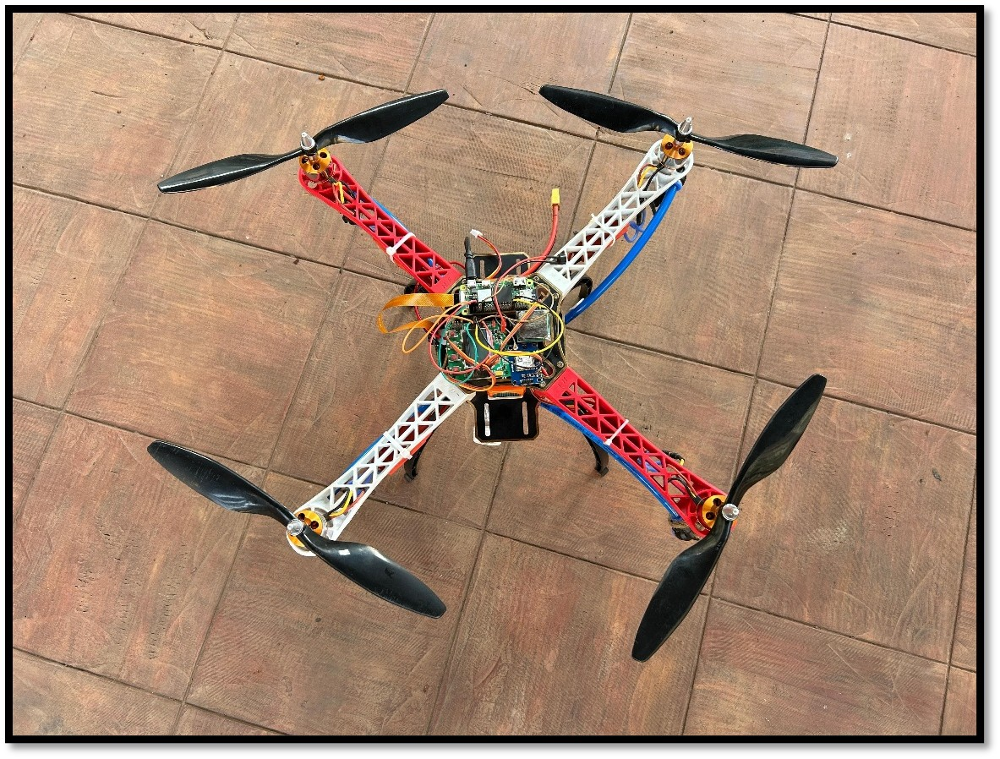
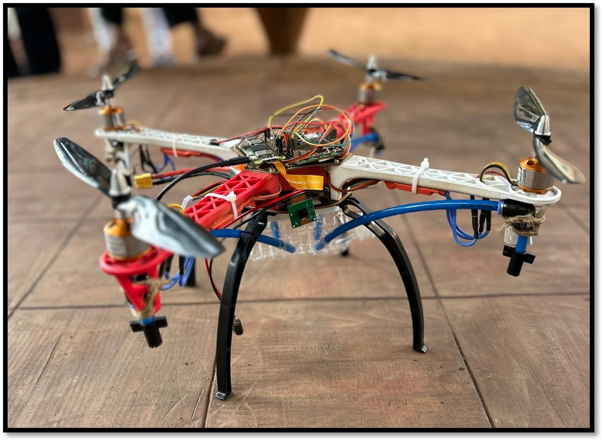
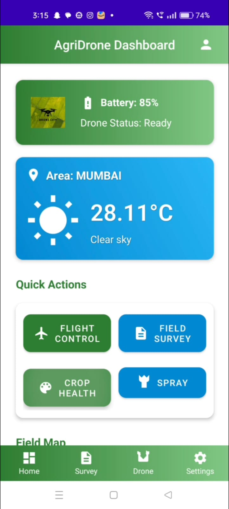
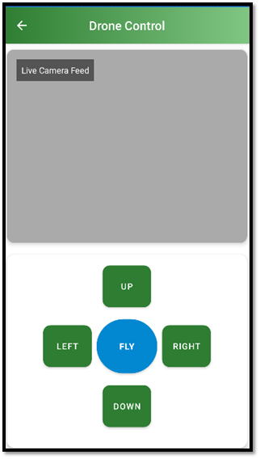
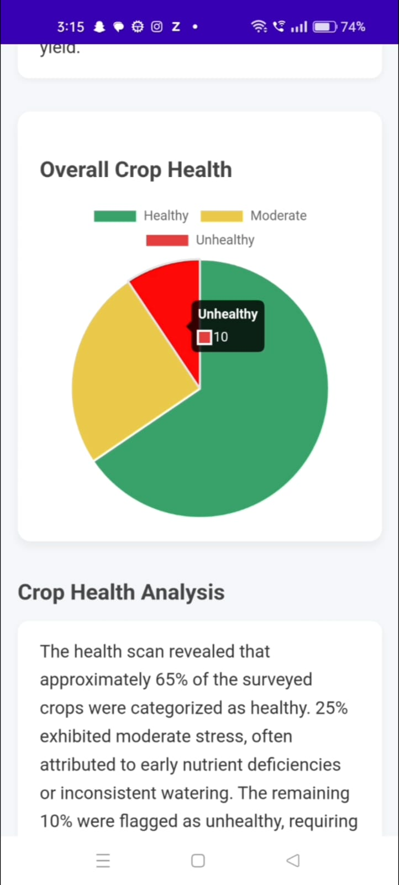
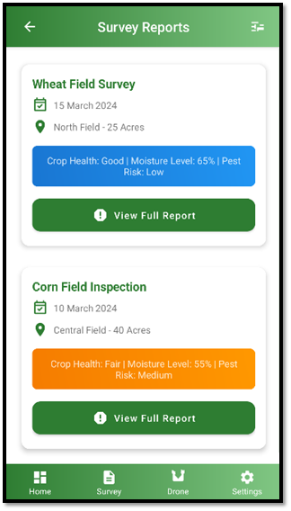
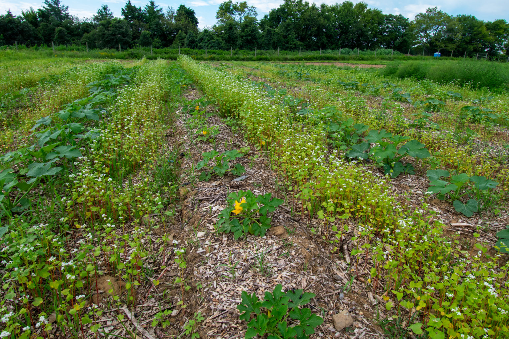
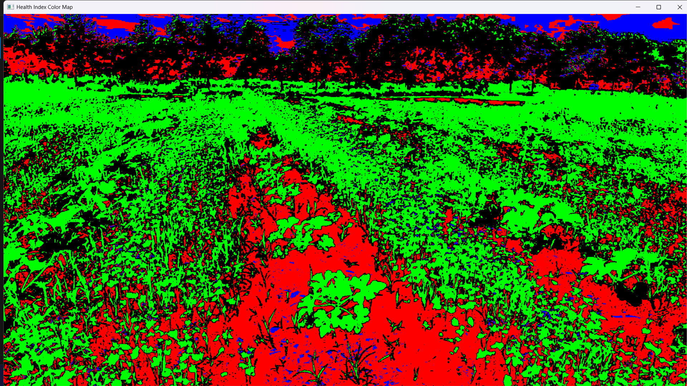
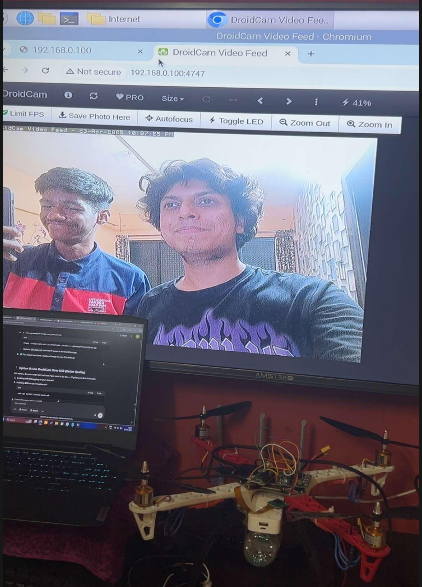
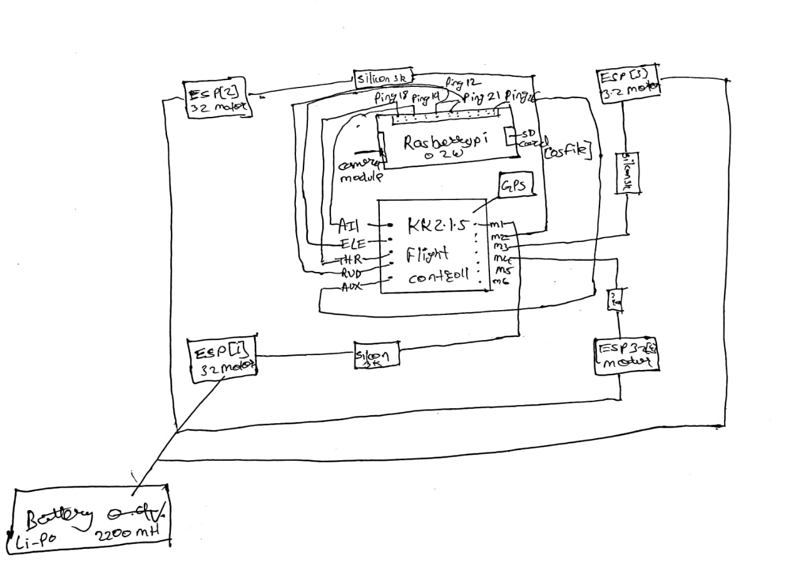

# Agricultural Drone for Precision Farming

### Prototype Version


An **Agricultural Drone for Precision Farming** is a smart farming system designed to improve agricultural productivity using **drone technology, crop detection algorithms, and a custom Android application**.

The system helps farmers monitor crop health, detect unhealthy areas, and perform **precision spraying** of fertilizer or pesticides only where required.

This project integrates **hardware, software, and image processing concepts** to demonstrate an **affordable precision agriculture solution**.

---

# ⚠️ Important Notice

This project is currently a **prototype / experimental version**.

All known bugs, hardware limitations, and incomplete modules have already been identified and will be addressed in future iterations.

The goal of this prototype is to **demonstrate the core concept of autonomous crop monitoring and precision spraying using drones**, integrated with a mobile application and crop detection algorithm.

---

# 🌟 My Heroes..

This project is inspired by some of the greatest innovators and thinkers who proved that **curiosity, persistence, and imagination can change the world**.

| Innovator             | Famous Quote                                                                              |
| --------------------- | ----------------------------------------------------------------------------------------- |
| **Steve Jobs**        | “The people who are crazy enough to think they can change the world are the ones who do.” |
| **Elon Musk**         | “When something is important enough, you do it even if the odds are not in your favor.”   |
| **Leonardo da Vinci** | “Simplicity is the ultimate sophistication.”                                              |
| **Nikola Tesla**      | “The present is theirs; the future, for which I really worked, is mine.”                  |
| **Alan Turing**       | “Those who can imagine anything can create the impossible.”                               |
| **Katherine Johnson** | “Like what you do, and then you will do your best.”                                       |

These individuals represent the spirit behind this project:

**Never give up. Keep building. Keep experimenting.**

---

# 📌 Project Overview

The **Agricultural Drone for Precision Spraying and Monitoring** is designed to improve farming efficiency using modern technology.

The system enables farmers to:

* 🌾 Monitor crop health
* 🔍 Detect problem areas automatically
* 🎯 Spray fertilizer or pesticide precisely where needed
* 💧 Reduce resource wastage
* 📊 Improve agricultural productivity

The project combines:

* **Drone hardware**
* **Image processing algorithms**
* **Android mobile application**
* **Hardware–software integration**

---

# 🎯 Project Objectives

The main objectives of the project are:

* Improve crop monitoring efficiency
* Reduce manual inspection effort
* Detect crop stress or unhealthy areas early
* Enable precision spraying
* Provide farmers with real-time insights

---

# ⚙️ System Components

The system consists of **three main components**.

---

## 1️⃣ Drone Hardware System

The drone acts as the **data collection and spraying platform**.

### Main Functions

* Flies over agricultural fields
* Captures aerial crop images
* Identifies crop areas needing treatment
* Activates spraying mechanism

### Key Hardware Components

* Drone Frame
* Brushless Motors
* Electronic Speed Controllers (ESC)
* Flight Controller
* Battery & Power System
* Sprayer Mechanism
* Raspberry Pi / Processing Unit
* Camera Module

---

## 2️⃣ Crop Detection Algorithm

The crop detection system analyzes captured images to determine plant health.

### Algorithm Workflow

1. Capture aerial crop images
2. Analyze plant color patterns
3. Identify unhealthy crop regions
4. Mark affected areas
5. Trigger spraying mechanism

Healthy crops remain untouched while **unhealthy areas receive treatment**, enabling **precision agriculture instead of blanket spraying**.

---

## 3️⃣ Android Control Application

A custom **Android application** was developed to interact with the drone system.

### App Capabilities

* Connect to the drone
* Monitor flight status
* Start crop scanning
* View detection results
* Generate reports

The application provides a **simple and user-friendly interface for farmers and operators**.

---

# 🚀 Key Features

### 🌾 Crop Monitoring

Drone scans agricultural fields and captures aerial crop images.

### 🎯 Precision Spraying

Fertilizer or pesticide is sprayed **only on affected areas**.

### 📱 Android App Control

Users can control and monitor the drone using a smartphone.

### 📊 Crop Detection Algorithm

Automatically detects unhealthy crops and highlights them.

### ⚡ Automation

Reduces manual labour and increases farming efficiency.

---

# 🧪 Prototype Outputs

The project produced **three major outputs**.

---

### 1️⃣ Hardware Output — Agricultural Drone

A working prototype drone capable of:

* Stable flight control
* Crop scanning
* Sprayer mechanism integration

---

### 2️⃣ Software Output — Android Application

Custom Android application developed for:

* Drone control
* Monitoring flight data
* Displaying detection results

---

### 3️⃣ Algorithm Output — Crop Detection System

Image processing algorithm capable of:

* Detecting crop health conditions
* Identifying stressed areas
* Assisting precision spraying

---

# 📸 Project Screenshots

### 🚁 Drone Prototype

| Drone View 1                | Drone View 2                |
| --------------------------- | --------------------------- |
|  |  |

---

### 📱 Android Application UI

<table>
<tr>
<th>App Home</th>
<th>Drone Control</th>
<th>Detection Screen</th>
<th>Survey Screen</th>
</tr>

<tr>
<td align="center">

</td>

<td align="center">

</td>

<td align="center">

</td>

<td align="center">

</td>
</tr>
</table>


---

### 🌾 Crop Detection Output

<table>
<tr>
<th>Before Detection</th>
<th>After Detection</th>
</tr>

<tr>
<td align="center">

</td>

<td align="center">

</td>
</tr>
</table>

---

### 🔗 Drone – App Integration Test

| Integration Test |
| ---------------- |
|  |

---

# 🔌 Circuit Diagram

<table>
<tr>
<td width="50%" valign="middle" align="center" style="padding:10px;">



</td>
<td width="50%" valign="top" style="padding:10px;">

### Circuit Explanation

This circuit integrates the key hardware components necessary for the agricultural drone system:

- **Flight Controller Connections:** Manages drone stability and flight control, connected to motors and sensors.
- **Motor and ESC Wiring:** Brushless motors connected through Electronic Speed Controllers (ESCs) for precise speed control.
- **Power Distribution:** Centralized battery supply providing regulated power to all components including motors, controllers, and peripherals.
- **Raspberry Pi / Camera Integration:** Raspberry Pi serves as the processing unit, interfaced with the camera module for capturing aerial images.
- **Sprayer Control System:** Electronics controlling the spraying mechanism, triggered by the crop detection algorithm to release fertilizer or pesticides accurately.

</td>
</tr>
</table>

---

# 📊 System Architecture

```
Drone Camera
     ↓
Image Processing Algorithm
     ↓
Crop Health Detection
     ↓
Identify Problem Areas
     ↓
Precision Spraying
     ↓
Data Sent to Mobile Application
```

This workflow allows the system to **detect crop issues and respond automatically**.

---

# 👨‍💻 Team Members & Contributions

| Name               | Role                            | Contribution                                                         |
| ------------------ | ------------------------------- | -------------------------------------------------------------------- |
| **Divyanka Patil** | Team Leader                     | Project coordination, planning, UI/UX designs, core flight logic     |                   
| **Vedant Garud**   | Software & Hardware Development | Android app development, drone integration, crop detection algorithm |
| **Amruta Sarwade** | Research & Testing              | Literature research and testing modules                              |
| **Avadhut Patil**  | Hardware Support                | Drone assembly and component testing                                 |

---

# 🛠 Skills Developed

This project helped develop knowledge in:

* Drone System Design
* Embedded Systems
* Android Development
* Image Processing
* Hardware–Software Integration
* Team Collaboration
* Project Planning

---

# 🌍 Applications

This technology can be used in:

* 🌾 Precision Agriculture
* 🚜 Smart Farming Systems
* 📊 Crop Monitoring Platforms
* 🌱 Sustainable Farming Solutions
* 🛰 Remote Agricultural Analysis

---

# 🔮 Future Improvements

Planned upgrades include:

* AI-based crop disease detection
* Machine learning prediction models
* Advanced sensors (Hyperspectral / LiDAR)
* Real-time cloud analytics
* Autonomous drone navigation
* Integration with farm management systems

---

# ⭐ Final Note

This project represents a **first step toward building intelligent agricultural systems**.

Innovation begins with **small prototypes, experimentation, and persistence**.

> **“Stay hungry, stay foolish.” — Steve Jobs**
